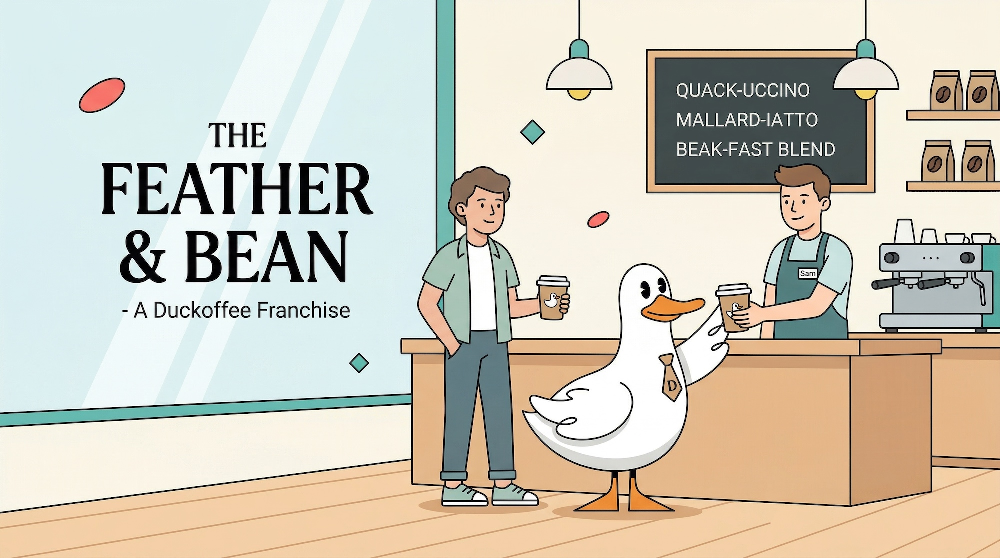

# Duckoffee map — Cloudflare Workers + MotherDuck

A full-stack Cloudflare example that renders a world map of imaginary **Duckoffee** cafes, a live sales chart, and a live vote for where Duckoffee should open its next location. It queries a MotherDuck share through the [Postgres wire protocol](https://motherduck.com/docs/key-tasks/authenticating-and-connecting-to-motherduck/postgres-endpoint/cloudflare-workers/) from a Worker, serves static assets via Workers Assets, and tallies votes in a Durable Object (SQLite-backed).



## What it demonstrates

- Reading data from a **MotherDuck share** through the Postgres endpoint (no DuckDB binary in the bundle)
- Serving a **static frontend** (HTML/CSS/JS + D3) from the same Worker via the `assets` binding
- Using a **Durable Object** to keep a small piece of shared state — a live tally of votes across 10 candidate cities, one vote per session, changeable at any time
- Interactive filtering: click a cafe on the map to scope the sales chart, summary tiles, and top-sellers list
- Interactive voting: click a candidate city (or a leaderboard row) to cast or change your vote, and watch the tally update across every open tab

## Prerequisites

- [Node.js](https://nodejs.org/) (v18+)
- [Cloudflare account](https://dash.cloudflare.com/sign-up)
- [MotherDuck account](https://motherduck.com/) with an access token

## Setup

```sh
cd cloudflare-workers-duckoffee
npm install
```

Add the MotherDuck token to your Worker:

```sh
npx wrangler secret put MOTHERDUCK_TOKEN
# Paste your MotherDuck token when prompted
```

## Local development

Create a `.dev.vars` file with your token:

```text
MOTHERDUCK_TOKEN="ey...MY_TOKEN"
```

Then run the dev server:

```sh
npx wrangler dev
```

Visit [http://localhost:8787](http://localhost:8787). Open the page in two tabs (or two browsers) to see votes propagate between clients — each tab gets its own `sessionStorage`-backed session ID, so each counts as a distinct voter.

## Routes

| Route                              | Description                                                                         |
| ---------------------------------- | ----------------------------------------------------------------------------------- |
| `GET /`                            | Static single-page app (map, chart, leaderboard)                                    |
| `GET /api/locations`               | All Duckoffee cafes with lifetime revenue and order counts                          |
| `GET /api/sales?location_id=&days=`| Daily revenue series (default 90 days, max 365). Optional `location_id` filter      |
| `GET /api/summary?location_id=`    | Totals and top 5 products, optionally scoped to a single location                   |
| `GET /api/votes?session_id=`       | Candidate cities with vote counts, the total, and the caller's current choice       |
| `POST /api/votes`                  | Cast or change a vote. Body: `{"session_id": "...", "candidate_id": "..."}`         |

## Architecture

```
 ┌──────────────┐  HTTPS   ┌────────────────────────┐   pg wire    ┌──────────────┐
 │   Browser    │ ───────► │    Cloudflare Worker   │ ───────────► │  MotherDuck  │
 │  (D3 + SPA)  │          │  ─ static assets       │              │  (duckoffee  │
 │              │          │  ─ /api/* SQL queries  │              │   share)     │
 │              │          │  ─ Durable Object:     │              └──────────────┘
 │              │  POST    │    VoteTracker         │
 │              │ ───────► │    (SQLite-backed)     │
 └──────────────┘          └────────────────────────┘
```

### The Durable Object

`VoteTracker` keeps a single global instance (named `"global"`) with one row per voting session (`session_id` is the primary key, so each session has exactly one active vote — re-voting overwrites). The tally endpoint does a simple `GROUP BY candidate_id`. It uses the Durable Object SQLite storage (`ctx.storage.sql`), which gives you a real SQL table without any external state.

## Deploy

```sh
npx wrangler deploy
```

The first deploy will create the `duckoffee-map` Worker and provision the `VoteTracker` Durable Object with SQLite storage. Subsequent deploys just upload new code.

## Security

As always, sanitize input on any endpoint that accepts it:

1. **Parameterize queries.** Every route uses numbered parameters — e.g. `WHERE location_id = $1::BIGINT` — rather than string interpolation.
2. **Validate inputs.** `days` is parsed as an integer and clamped to `[7, 365]`. `location_id` is parsed and rejected if it isn't a valid integer. `candidate_id` must be one of the 10 hardcoded candidates, and `session_id` must be a short string.
3. **Read-only warehouse workload.** The Worker only issues `SELECT` statements against the attached share — there is no path from user input to a MotherDuck write. Votes live entirely in the Durable Object.

## Customizing

- **Add a candidate city.** Add an entry to `CANDIDATES` in `src/index.ts`. The `id` becomes the stable key stored in the Durable Object, so pick something kebab-case and don't rename it after the fact.
- **Add an existing cafe.** Drop a new row into `duckoffee.locations` (in your own copy of the dataset) and add the lat/lon to the `CITY_COORDS` map in `src/index.ts`.
- **Tweak the look.** Brand colors live as CSS variables at the top of `public/style.css`. The ducks and database characters under `public/assets/` can be swapped for your own SVGs.

## Recreate this from scratch with your own theme

See [`PROMPT.md`](./PROMPT.md) for a single self-contained prompt you can paste into a coding agent (Claude Code, Cursor, Codex, etc.) to build a variant of this project with your own brand, dataset, and voting question, keeping the same Worker + Durable Object + MotherDuck architecture.
