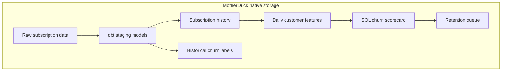

# dbt churn prediction with MotherDuck native storage

This example shows how to build a SQL-first churn prediction workflow using dbt, DuckDB, and MotherDuck native storage.

The sample business is a subscription company with subscription members and pay-per-use customers across a few regions. The dbt project builds clean source models, derives subscription history, creates daily churn features, applies a transparent SQL scorecard, and publishes a retention queue that a marketing or operations team can act on.

The example is intentionally compact. It is meant to be copied, understood, and modified without introducing a separate ML platform.

## What this example does

- Loads small sample source tables with `dbt seed`
- Cleans customer, membership, usage event, and payment data in staging models
- Builds subscription episodes with churn and right-censoring fields
- Creates daily customer features for churn scoring
- Creates historical churn labels for model review or future training
- Scores churn risk in dbt SQL using observed segment churn rates and interpretable rules
- Publishes a business-facing retention queue with reasons and recommended actions
- Runs locally with DuckDB or in MotherDuck native storage

This example does not use DuckLake or external object storage. In the MotherDuck target, the raw seed tables and dbt models are regular MotherDuck tables.

## Modeling approach

This project uses an explainable risk scoring model, implemented entirely in SQL.

The daily score table combines two interpretable signals:

```text
observed_churn_rate =
  historical churned customers / historical labeled customers

risk_score =
  matched risk-rule points
  + observed_churn_rate adjustment
```

The risk rules live in `seeds/churn_risk_rules.csv`, which makes the scoring logic easy to review, version, and replace. A rule can represent an explainable signal such as failed payment, manual renewal risk, long engagement gap, recent complaint, declining usage, or low satisfaction. The important design choice is that daily scoring remains simple SQL in dbt.

The subscription modeling uses survival-analysis concepts without requiring Python runtime scoring:

- `fct_subscription_history` represents each membership as an episode.
- Active subscriptions are right-censored at `churn_as_of_date`.
- Expired non-active subscriptions use a configurable grace period before being treated as churned.
- Subscription-start attributes such as plan length, payment method, acquisition channel, and auto-renewal are preserved for feature engineering.
- `prior_memberships` captures whether a customer is on a first subscription or a reactivated subscription.

This approach works well for operational churn workflows because it is explainable, portable, and easy to schedule. It also gives data science teams a clean foundation for later cohort analysis, survival analysis, or more advanced modeling.

## Why use this approach

Churn workflows often fail because the prediction is disconnected from the operational table the business needs. This example keeps the full path in one dbt graph:

- source data
- subscription history
- churn labels
- daily features
- daily scores
- retention queue

That makes the logic inspectable and testable. It also means BI tools, reverse ETL jobs, agents, or applications can query the same MotherDuck tables directly.

The scorecard is deliberately not a black box. Operators can see why a customer appears in the queue: failed payment, manual renewal risk, complaint, long engagement gap, or no recent usage events.

## Churn definitions

The example separates two customer behaviors:

- `member`: subscription customers. The example scores 30-day churn risk.
- `casual`: pay-per-use customers. The example scores 60-day no-return risk.

Casual customers are scored only after they have enough history:

- at least 2 usage events in the last 120 days, or
- at least 3 usage events in the last 180 days

That rule keeps one-time users or buyers from filling the retention queue.

For members, the project models subscription episodes and uses `member_churn_grace_period_days` from `dbt_project.yml`. The default grace period is 30 days.

## Project structure

```text
dbt-churn-prediction/
+-- dbt_project.yml
+-- profiles.yml
+-- seeds/
|   +-- raw_customers.csv
|   +-- raw_memberships.csv
|   +-- raw_usage_events.csv
|   +-- raw_payments.csv
|   +-- churn_risk_rules.csv
+-- models/
|   +-- staging/
|   |   +-- _sources.yml
|   |   +-- stg_customers.sql
|   |   +-- stg_memberships.sql
|   |   +-- stg_usage_events.sql
|   |   +-- stg_payments.sql
|   +-- marts/
|       +-- fct_subscription_history.sql
|       +-- fct_customer_features_daily.sql
|       +-- fct_customer_churn_labels.sql
|       +-- fct_customer_churn_scores_daily.sql
|       +-- mart_retention_queue_daily.sql
+-- tests/
    +-- assert_one_feature_row_per_customer_per_day.sql
    +-- assert_one_score_row_per_customer_per_day.sql
    +-- assert_risk_scores_between_zero_and_100.sql
    +-- assert_segment_rates_between_zero_and_one.sql
    +-- assert_casual_scores_are_eligible.sql
    +-- assert_subscription_duration_positive.sql
    +-- assert_subscription_censoring_consistent.sql
```

## Data flow



For the sample, `dbt seed` creates the raw tables. In a real workflow, an ingestion tool such as dlt, Airbyte, Fivetran, custom Python, or application exports can land equivalent tables in the raw schema. dbt owns the transformation, labeling, scoring, tests, and mart tables.

## Prerequisites

- Python 3.12+
- `uv` or another Python environment manager
- A MotherDuck account and token for the `prod` target
- DuckDB is pinned in `pyproject.toml` so the local package matches the MotherDuck-supported extension version

Copy the example environment file when you want to run against MotherDuck:

```sh
cp .env.example .env
```

Then set:

```sh
MOTHERDUCK_TOKEN=your_token_here
MOTHERDUCK_DATABASE=subscription_churn
```

## Run locally with DuckDB

Install dependencies:

```sh
uv sync
```

Load the sample raw tables:

```sh
uv run dbt seed --profiles-dir . --full-refresh
```

Build models and run tests:

```sh
uv run dbt build --profiles-dir . --exclude resource_type:seed
```

Inspect the action queue:

```sh
uv run dbt show --profiles-dir . --select mart_retention_queue_daily
```

The local target writes to `local.db`.

## Run in MotherDuck

Create the MotherDuck database once:

```sql
CREATE DATABASE IF NOT EXISTS subscription_churn;
```

Set a MotherDuck token:

```sh
set -a
source .env
set +a
```

Load the sample raw tables into MotherDuck native storage:

```sh
uv run dbt seed --profiles-dir . --target prod --full-refresh
```

Build and test the churn graph:

```sh
uv run dbt build --profiles-dir . --target prod --select tag:churn_daily+ --exclude resource_type:seed
```

Inspect the queue:

```sh
uv run dbt show --profiles-dir . --target prod --select mart_retention_queue_daily
```

## Main outputs

All models and seeds have table and column descriptions in YAML, and `persist_docs` is enabled in `dbt_project.yml`. When the adapter supports it, dbt writes those descriptions as relation and column comments in DuckDB or MotherDuck.

Those comments are useful for AI agents and BI assistants. They help tools inspect the catalog, understand the grain and meaning of each field, and generate safer SQL against the churn tables.

`fct_subscription_history` has one row per subscription episode:

- `started_at`, `ended_at`, `duration_days`
- `churned` and `is_censored`
- `prior_memberships`
- initial subscription attributes for plan, payment method, auto-renewal, and acquisition channel

`fct_customer_features_daily` has one row per `customer_id` and `as_of_date`. It includes stable, explainable features:

- recency: `days_since_last_event`
- frequency: `events_30d`, `events_60d`, `events_90d`
- monetary: `spend_90d`
- membership risk: `failed_payments_30d`, `days_until_renewal`, `membership_age_days`, `prior_memberships`, `is_auto_renew`
- experience: `complaints_60d`, `avg_satisfaction_60d`
- eligibility: `is_eligible_for_scoring`

`fct_customer_churn_labels` demonstrates label generation for historical evaluation:

- members churn over a 30-day horizon
- casual customers churn when they are eligible and do not return in 60 days

`fct_churn_segment_rates` calculates observed historical churn rates by segment and prediction window.

`fct_customer_churn_scores_daily` applies the risk rules, joins observed segment churn rates, and returns one scored row per eligible customer per scoring date.

`mart_retention_queue_daily` is the business-facing table:

- `queue_rank`
- `customer_id`
- `segment`
- `observed_churn_rate`
- `risk_score`
- `risk_band`
- `top_reason_1`, `top_reason_2`, `top_reason_3`
- `recommended_action`
- `offer_type`

## Use this with your data

Start by mapping your own data to the four raw tables used in this example:

- `raw_customers`: one row per customer
- `raw_memberships`: one row per subscription or membership episode
- `raw_usage_events`: one row per customer usage event, purchase event, or product activity event
- `raw_payments`: one row per payment attempt

If your use case is not subscription-based, keep the model structure and replace the domain-specific fields:

- Replace usage events with product sessions, orders, invoices, appointments, or other activity events.
- Replace complaints with support tickets, refunds, low NPS, failed jobs, or negative product outcomes.
- Replace memberships with contracts, plans, subscriptions, accounts, or seats.
- Replace regions with workspace, account owner, plan, geography, or customer segment.

Then update these parts:

1. Update `models/staging/_sources.yml` if your raw table names differ.
2. Update the staging models to cast and normalize your source fields.
3. Update `fct_subscription_history` if your churn definition uses a different grace period or renewal rule.
4. Update `fct_customer_features_daily` with the features that matter in your business.
5. Replace `churn_risk_rules.csv` with risk rules, point values, reasons, and actions that match your use case.
6. Update the labels in `fct_customer_churn_labels` to match the horizon your team cares about.
7. Keep the mart output focused on the action queue your team will actually use.

For production runs, schedule:

```sh
dbt seed --target prod --full-refresh
dbt build --target prod --select tag:churn_daily+ --exclude resource_type:seed
```

If raw data is loaded by an ingestion job instead of dbt seeds, schedule only the `dbt build` command after the raw data load completes.

## Tests included

This example includes schema tests and singular tests for:

- unique source and staging keys
- accepted status and segment values
- one feature row per customer per date
- one score row per customer per date
- observed segment churn rates between 0 and 1
- risk scores between 0 and 100
- casual customers only scored when eligible
- positive subscription durations
- consistent subscription churn and censoring flags

Add use-case-specific tests before using the model operationally, especially around source freshness, label leakage, consent rules, and offer eligibility.

## Notes and limits

- The included risk rules and points are example values, not calibrated thresholds for your business.
- The score is designed for explainability and fast adoption, not maximum predictive accuracy.
- Do not send retention offers directly from this table without consent, compliance, and suppression logic.
- For a larger deployment, keep daily scoring in SQL and periodically review observed churn rates, rule thresholds, and action outcomes.
