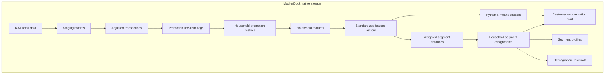

# dbt customer segmentation with MotherDuck native storage

This starter shows how to build a customer segmentation workflow with dbt, DuckDB, Python models, and MotherDuck native storage. It is designed as a customer template: the sample data is small, but the modeling pattern is realistic enough to adapt to production retail, marketplace, subscription, or loyalty data.

The example uses a grocery retailer that wants to group households by promotion responsiveness. It prepares retail source tables, derives promotion-response features, assigns households to interpretable segments, and publishes both an activation mart and profiling tables.

## What this example builds

- Raw source tables loaded with `dbt seed`
- Typed staging models for transactions, products, households, campaigns, coupons, redemptions, and campaign targeting
- Adjusted transaction measures for list amount, paid amount, coupon discounts, manufacturer matches, and in-store discounts
- Promotion line-item flags for campaign targeting, retailer coupons, manufacturer coupons, private label, and store discounts
- Household-level promotion metrics and normalized behavioral features
- Standardized feature vectors for segmentation
- Python k-means cluster assignments aligned to business segment definitions
- Weighted centroid-distance segment assignment for reviewable activation
- Segment confidence, feature profiles, and demographic Pearson residuals
- A business-facing `mart_customer_segments` table ready for BI, reverse ETL, or application reads

This project does not use DuckLake or external object storage. The MotherDuck target stores seeds and dbt models as regular MotherDuck tables.

## Analytical flow

This starter follows a common customer segmentation pattern:

```text
data prep
  -> promotion feature engineering
  -> transformed/reduced features
  -> Python clustering
  -> explainable segment assignment
  -> segment profiling
```

The project uses dbt SQL models where the transformation is relational and dbt Python where the task is naturally model-oriented. The Python model runs k-means over standardized household features. The SQL centroid model then provides a stable, reviewable assignment layer that business users can tune without changing Python code.

## Modeling approach

The workflow has two complementary segmentation layers.

The Python model `fct_household_kmeans_segments` fits k-means over the standardized feature matrix. It returns the cluster id, cluster size, household distance to the assigned k-means center, per-household silhouette score, and the overall silhouette score. Each learned k-means cluster is aligned to the nearest configured business segment so the output is usable in the final mart.

The centroid model is controlled by `seeds/segment_centroids.csv`. Each row defines one expected standardized feature value and feature weight for a segment.

The model calculates distance from every household to every segment:

```text
segment_distance =
  sqrt(sum(feature_weight * (household_feature_value - centroid_value)^2) / sum(feature_weight))
```

The nearest configured segment wins. The second-nearest segment is retained so the final mart can expose a simple confidence score:

```text
segment_confidence =
  (alternative_segment_distance - segment_distance) / alternative_segment_distance
```

The sample centroids define four starter business segments:

- `promotion_maximizers`: households that buy campaign-targeted products and respond to retailer coupons or broad store discounts
- `private_label_loyalists`: households that over-index on owned-brand or private-label products
- `brand_deal_seekers`: households that respond to manufacturer coupons and national-brand promotions
- `steady_full_price`: high-engagement households with limited discount dependence

You can change business segment behavior without rewriting SQL or Python by editing `segment_centroids.csv` and `segment_playbook.csv`.

## Why these choices

The project uses SQL for the deterministic transformation work because these steps are easiest to review as relational logic. Source cleanup, discount normalization, campaign-product attribution, feature aggregation, standardization, distance scoring, and profiling all benefit from explicit CTEs and dbt tests.

The project uses a dbt Python model for k-means because clustering is algorithmic, not relational. Running it inside dbt keeps the feature engineering, clustering, and mart publication in one DAG while still using the right tool for the model fit.

The final assignment uses configured centroids because k-means cluster labels are not stable business labels. Cluster `0` in one run may not mean the same thing after a feature change, seed change, or new production data. The centroid layer gives business stakeholders named segments with explicit expectations and weights.

The final mart keeps both outputs because they answer different questions:

- The Python k-means fields help analysts inspect discovered behavioral groupings.
- The centroid fields provide stable segment names, recommendations, and offers for activation.
- The alignment fields show whether the discovered clusters agree with the configured business segment definitions.

The sample data is intentionally small so the starter is easy to run and inspect. The pattern scales by replacing seeds with production tables and revisiting the feature list, k-means config, and centroid definitions.

## Important assumptions

- Campaign attribution is simplified. If a household was targeted for a campaign product, purchases of that product are treated as campaign-targeted purchases. This should be revisited for production attribution.
- Coupon redemptions are not joined directly back to individual transaction lines. The transaction line carries the discount signal used for feature engineering.
- Missing continuous promotion features are mean-imputed after standardization by setting missing standardized values to zero. This keeps the centroid model stable while preserving a separate binary signal for whether the behavior occurred.
- Python k-means labels are not inherently stable business labels. This starter aligns learned clusters to configured segment centroids so customers can compare discovery-oriented clusters with activation-oriented segment definitions.
- Demographic residuals are for profiling and explainability. They should not be used for protected-class targeting or automated exclusion.

## Project structure

```text
dbt-customer-segmentation/
+-- dbt_project.yml
+-- profiles.yml
+-- seeds/
|   +-- raw_transactions.csv
|   +-- raw_products.csv
|   +-- raw_households.csv
|   +-- raw_campaigns.csv
|   +-- raw_coupons.csv
|   +-- raw_coupon_redemptions.csv
|   +-- raw_campaign_households.csv
|   +-- segment_centroids.csv
|   +-- segment_playbook.csv
+-- models/
|   +-- staging/
|   +-- intermediate/
|   +-- marts/
+-- tests/
```

## Data flow



## Key models

- `int_transactions_adjusted`: converts negative source discounts into positive analytical measures.
- `int_promotional_line_items`: flags each transaction line for campaign targeting, coupons, private label, and in-store discounts.
- `fct_household_promotion_metrics`: aggregates purchase-date and spend metrics by household.
- `fct_household_features`: converts metrics into normalized features and binary behavior flags.
- `fct_household_feature_vectors`: standardizes features for distance-based scoring.
- `fct_household_kmeans_segments`: uses dbt Python and scikit-learn to fit k-means clusters over the standardized feature matrix.
- `fct_household_segment_distances`: calculates weighted distance to every configured segment.
- `fct_household_segments`: assigns the nearest segment and confidence score.
- `fct_segment_feature_profiles`: explains what each segment looks like behaviorally.
- `fct_segment_demographic_residuals`: profiles demographic over- or under-representation with Pearson residuals.
- `mart_customer_segments`: final activation table for BI or operational use.

## How to interpret results

Start with `mart_customer_segments`. Each row is one household, with the configured business segment assignment, the nearest alternative segment, confidence, core behavior metrics, the strongest standardized features, and recommended activation.

Key columns in `mart_customer_segments`:

- `segment_name` and `segment_label`: the configured business segment assigned by nearest centroid distance.
- `segment_confidence`: the gap between the nearest and second-nearest configured segments. Values closer to `1` mean the household is much closer to its assigned segment than to the next-best segment. Values near `0` mean the assignment is ambiguous.
- `alternative_segment_name`: the segment that nearly won. This is useful for QA and for identifying households near a boundary.
- `strongest_standardized_features`: the largest absolute standardized feature values for the household. These are a quick explanation of what made the household stand out.
- `kmeans_cluster_id`: the discovered Python k-means cluster. Treat this as an analytical grouping, not a durable business label.
- `kmeans_aligned_segment_name`: the configured segment whose centroid is nearest to that k-means cluster center.
- `kmeans_silhouette_score`: a per-household measure of clustering fit. Higher values are better. Negative values suggest the household may fit another k-means cluster better.
- `overall_kmeans_silhouette_score`: the overall k-means quality score for this sample and configuration. Use it to compare different `python_cluster_count` values, not as an absolute guarantee of business usefulness.

Use `fct_segment_feature_profiles` to understand what each segment means behaviorally. Positive `avg_standardized_value` means the segment is above the population average for that feature; negative values mean it is below average. `centroid_gap` shows where observed segment behavior differs from the configured centroid and may need recalibration.

Use `fct_segment_demographic_residuals` for profiling only. `pearson_residual` compares observed counts to expected counts in a complete segment-by-category grid:

- Absolute values below `2` are usually within the expected range for this exploratory template.
- Absolute values above `2` indicate notable over- or under-representation.
- Absolute values above `4` indicate very strong over- or under-representation.

Demographic residuals can explain who ended up in a segment, but they should not drive protected-class targeting or exclusion logic.

Use `fct_household_kmeans_segments` when tuning clustering. Compare `overall_kmeans_silhouette_score`, cluster sizes, and cluster-to-segment alignment after changing feature definitions or `python_cluster_count`.

## Prerequisites

- Python 3.12+
- `uv` or another Python environment manager
- A MotherDuck account and token for the `prod` target

DuckDB is pinned in `pyproject.toml` so the local package matches the supported MotherDuck extension version used by this starter.

## Run locally with DuckDB

Install dependencies:

```sh
uv sync
```

Load the sample raw tables:

```sh
uv run dbt seed --profiles-dir . --full-refresh
```

Build models and run model tests:

```sh
uv run dbt build --profiles-dir . --exclude resource_type:seed
```

Run the full test suite, including seed tests:

```sh
uv run dbt test --profiles-dir .
```

Inspect the final mart:

```sh
uv run dbt show --profiles-dir . --select mart_customer_segments
```

The local target writes to `local.db`.

## End-to-end validation

This starter was validated end to end locally and in MotherDuck.

Local DuckDB validation:

```sh
uv sync
uv run dbt seed --profiles-dir . --full-refresh
uv run dbt build --profiles-dir . --exclude resource_type:seed
uv run dbt test --profiles-dir .
```

MotherDuck validation:

```sh
uv run dbt seed --profiles-dir . --target prod --full-refresh
uv run dbt build --profiles-dir . --target prod --select tag:customer_segmentation+ --exclude resource_type:seed
uv run dbt test --profiles-dir . --target prod
```

The latest validation passed with 19 models, 9 seeds, and 102 data tests. The build includes the dbt Python k-means model on both local DuckDB and MotherDuck.

## Run in MotherDuck

Copy and edit the example environment file:

```sh
cp .env.example .env
```

Set:

```sh
MOTHERDUCK_TOKEN=your_token_here
MOTHERDUCK_DATABASE=customer_segmentation
```

Create the MotherDuck database once:

```sql
CREATE DATABASE IF NOT EXISTS customer_segmentation;
```

Load the environment variables:

```sh
set -a
source .env
set +a
```

Load the sample raw tables into MotherDuck native storage:

```sh
uv run dbt seed --profiles-dir . --target prod --full-refresh
```

Build the segmentation graph:

```sh
uv run dbt build --profiles-dir . --target prod --select tag:customer_segmentation+ --exclude resource_type:seed
```

Run the full MotherDuck test suite:

```sh
uv run dbt test --profiles-dir . --target prod
```

Inspect segment distribution:

```sh
uv run dbt show --profiles-dir . --target prod --inline '
select
  segment_name,
  count(*) as households,
  round(avg(segment_confidence), 3) as avg_confidence
from {{ ref('mart_customer_segments') }}
group by 1
order by 1
'
```

## Customize for production

1. Replace the CSV seeds with landed production tables from your ingestion tool.
2. Keep the staging models explicit so discount sign conventions and null handling remain visible.
3. Add or remove feature rows in `fct_household_features_long.sql`.
4. Tune the `fct_household_kmeans_segments` model config in `dbt_project.yml` for discovery-oriented clustering experiments.
5. Update `segment_centroids.csv` so centroids reflect your business definitions or observed clusters.
6. Update `segment_playbook.csv` with actions, offers, or operational routing for each segment.
7. Use the residual tables to understand segment makeup, not to target protected attributes.

The safest production path is to keep this dbt graph as the auditable feature and scoring layer, compare Python clustering output with configured centroid assignments, then change activation logic only after the business agrees on the segment definitions.
