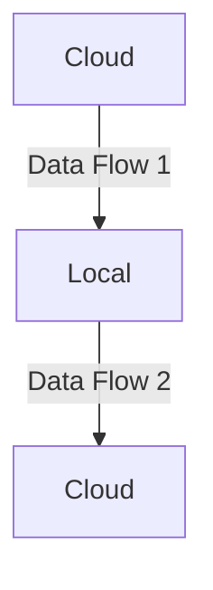

# MotherDuck Dual Execution example with dbt

The objective of this project is to show a minimal example of dual execution in Motherduck with dbt. The basic premise is `dbt init` with one additional model and a simple `dev` profile in the `profiles.yml` file. By using `attach`, we can add a second database in the execution context of that database and write it to a physical file.

## Example Profiles.yml

```
dual_execution:
  outputs:
    dev:
      type: duckdb
      path: "md:my_db"   # motherduck path
      attach:
        - path: local.db # local path
  target: dev
```

## Example local model

In order to use the local model, we need to use the `database` parameter in the model configuration. Then we reference the model like any another model.

```
{{ config(
    database="local",
    materialized="table"
) }}
```

## Data flow

In this example, data flow from:



