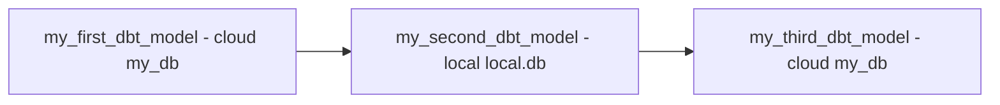

# dbt Dual Execution Across Local DuckDB and MotherDuck

This is a minimal dbt-duckdb project that shows MotherDuck dual execution: a single dbt run that has both a MotherDuck connection and a local DuckDB file attached at the same time. Because both databases live in one DuckDB execution context (via DuckDB's `ATTACH`), you choose per model where a table materializes by setting its `database` config. The `example/` models hop cloud -> local -> cloud, and the `tpcds/` models read from a MotherDuck source and sample down when the target is local, so you can iterate on transformations cheaply on disk and promote the same code to the cloud unchanged.

## How dual execution works

The trick is that `ATTACH` brings MotherDuck databases and a local DuckDB file into one DuckDB session. Once attached, you address each by its database name, and dbt's `database=` config decides where each model materializes.

The `local` profile output (the default target) sets `path: local.db` and attaches all of MotherDuck:

```yaml
dual_execution:
  outputs:
    local:
      type: duckdb
      path: local.db
      attach:
        - path: "md:"        # attaches all MotherDuck databases
      threads: 4
    prod:
      type: duckdb
      path: "md:jdw_dev"     # connect straight to one MotherDuck database
      threads: 4
  target: local
```

Pin an individual model to a MotherDuck database with the `database` config:

```sql
{{ config(
    database="my_db",
    materialized="table"
) }}
```

To keep a model on the local file instead, omit `database` so it falls back to the target's default database. Under `--target local` the default is the `local.db` file, so the model lands on disk. The `example/` models use exactly this pattern: `my_first_dbt_model` and `my_third_dbt_model` set `database="my_db"` (cloud), while `my_second_dbt_model` has no `database` config, so it materializes in the local default database. Following the `ref()` chain shows data moving cloud -> local -> cloud within a single run:


```mermaid
graph LR
    A[my_first_dbt_model - cloud my_db] --> B[my_second_dbt_model - local local.db]
    B --> C[my_third_dbt_model - cloud my_db]
```

The `tpcds/` models show the read side of the pattern. The `tpcds/raw/` models `select from` a MotherDuck source defined in `_sources.yml`, and `store_sales.sql` guards the read with the target name so local runs sample 1% while the cloud reads everything:

```sql
from {{ source("tpc-ds", "store_sales") }}
 using sample 1 % 
```

The `tpcds/queries/` models (`query_1.sql` ... `query_99.sql`) are the TPC-DS analytical queries materialized as views on top of the raw models.

## What you'll adjust

| Setting | Purpose | Options / example |
| --- | --- | --- |
| `profiles.yml` target | Which execution context dbt connects to. `local` connects to a local file and attaches all MotherDuck databases; `prod` connects directly to a MotherDuck database. | `--target local` (default) or `--target prod` |
| `local.path` (profiles `local` output) | Path of the on-disk DuckDB file. This is also the *default* database for `local` runs, so any model without an explicit `database=` lands here. | `path: local.db` |
| `local.attach` (profiles `local` output) | What gets attached alongside the local file. `"md:"` attaches every MotherDuck database; narrow it to one with `md:my_db` to limit scope and speed up startup. | `attach: - path: "md:"` |
| `prod.path` (profiles `prod` output) | The MotherDuck database used when running directly in the cloud (the default database under `--target prod`). | `path: "md:jdw_dev"` |
| `database=` in `{{ config(...) }}` | Per-model choice of where a table lands: a MotherDuck database name (cloud) or omit it to use the target's default database. | `database="my_db"` (cloud) |
| `models/tpcds/raw/_sources.yml` | The MotherDuck source the `tpcds` raw models read from. Repoint these to your own database/schema. | `database: jdw_dev`, `schema: jdw_tpcds` |
| `` sampling | Reduces source rows on local runs so iteration is fast; full data runs in the cloud. | `using sample 1 %` in `models/tpcds/raw/store_sales.sql` |
| `dbt_project.yml` model materializations | Default materialization per folder (`example` as views, `tpcds/raw` as tables, `tpcds/queries` as views). | `+materialized: table` / `view`, `+tags: ['raw']` |
| `threads` (both profile outputs) | dbt concurrency for the run. | `threads: 4` |

## Questions to answer

- Which MotherDuck database(s) should models target, and which models should stay local on disk (no explicit `database=`)?
- What is the source database and schema the raw models should read from (here `jdw_dev.jdw_tpcds`)? Does it already exist in your account?
- Should local runs sample the source data, and at what rate, or read it in full?
- Local-only iteration, cloud-only, or the dual (attach both) setup as configured here?
- Is a MotherDuck token already configured in the shell, or should auth happen via the browser prompt?

## Run it

Prerequisites: a MotherDuck account, dbt-duckdb (pinned to `1.9.3` in `pyproject.toml`), and (for non-interactive runs) a `MOTHERDUCK_TOKEN` in your shell. The source database and schema referenced in `_sources.yml` (`jdw_dev.jdw_tpcds`) must exist in your account, or repoint them to your own tables before running the `tpcds` models.

```bash
# install dbt-duckdb into a managed venv
uv sync

# build everything with the default target (local file + attached MotherDuck)
uv run dbt build

# or pick a target explicitly
uv run dbt run --target local   # writes default-db materializations to local.db, reads MotherDuck
uv run dbt run --target prod    # runs directly against the MotherDuck database in profiles.yml
```

The first cloud run opens a browser prompt for MotherDuck authentication unless `MOTHERDUCK_TOKEN` is already set in the shell.

## Files

- [`dbt_project.yml`](dbt_project.yml) - the dbt project config: names the project `dual_execution` and sets per-folder defaults (`example` as views, `tpcds/raw` as tables, `tpcds/queries` as views).
- [`profiles.yml`](profiles.yml) - the two connection targets: `local` (local.db plus `attach: "md:"`) and `prod` (direct `md:jdw_dev`), with `local` as the default target.
- [`pyproject.toml`](pyproject.toml) - the Python project for `uv`, pinning `dbt-duckdb==1.9.3`.
- [`uv.lock`](uv.lock) - the resolved dependency lockfile for `uv sync`.
- [`models/example/`](models/example/) - the cloud -> local -> cloud demo: three starter models where `my_first`/`my_third` set `database="my_db"` (cloud) and `my_second` omits it (local), plus [`schema.yml`](models/example/schema.yml) with unique/not_null tests.
- [`models/tpcds/raw/`](models/tpcds/raw/) - 24 raw models that select from the MotherDuck TPC-DS source; `store_sales.sql` shows the `target.name == 'local'` sampling guard. Source is defined in [`_sources.yml`](models/tpcds/raw/_sources.yml) (`jdw_dev.jdw_tpcds`).
- [`models/tpcds/queries/`](models/tpcds/queries/) - the 99 TPC-DS analytical queries (`query_1.sql` ... `query_99.sql`) materialized as views on top of the raw models.
- [`analyses/`](analyses/), [`macros/`](macros/), [`seeds/`](seeds/), [`snapshots/`](snapshots/), [`tests/`](tests/) - the standard empty dbt scaffold directories (each holds only a `.gitkeep`).
- [`.gitignore`](.gitignore) - excludes dbt build output and `*.db`, so the local `local.db` is intentionally not version-controlled.
- `.python-version`, `.user.yml` - the pinned Python version for `uv` and dbt's per-user invocation id.

## Caveats

- **Same database name across targets.** `database="my_db"` is hard-coded in the `example/` models. Under `--target local` that name resolves only because `attach: "md:"` brings `my_db` into the session, and under `--target prod` it resolves only if `my_db` exists in your account. If the database does not exist in MotherDuck, the run fails. Create it first or change the name.
- **Switching targets changes where "local" models land.** Models without `database=` follow the target default. With `--target prod` (default db `md:jdw_dev`) those models materialize in the cloud, not on disk, so `--target prod` is not a true "everything in cloud" run unless every model pins its `database`.
- **`attach: "md:"` attaches everything.** It pulls in all MotherDuck databases on every local run, which can be slow if you have many. Narrow it to `md:my_db` when you only need one.
- **Source must exist before the raw models run.** `_sources.yml` points at `jdw_dev.jdw_tpcds`. dbt does not create sources; if that database/schema is absent (or you have not been granted access), the `tpcds` models error. Repoint `_sources.yml` to data you actually have.
- **Sampling only kicks in on the `local` target.** The `using sample 1 %` clause is gated by `target.name == 'local'`. Renaming the local target, or running under any other target, silently reads the full source, which can be expensive on large tables.
- **Don't put your token in `profiles.yml`.** Authenticate with the `MOTHERDUCK_TOKEN` environment variable (or the browser prompt), not by committing a token into the profile or connection string.
- **`*.db` is gitignored.** The local `local.db` file is excluded by `.gitignore`, so local materializations are intentionally not version-controlled; expect a fresh file on a clean checkout.
- **dbt-duckdb version is pinned.** `pyproject.toml` pins `dbt-duckdb==1.9.3`. The ATTACH/dual-execution behavior here is verified against that version; newer or older releases may differ.

## Learn more

- For deeper MotherDuck or DuckDB questions (ATTACH semantics, dual/hybrid execution, dbt-duckdb config), use the `ask_docs_question` MCP tool or the MotherDuck docs.
