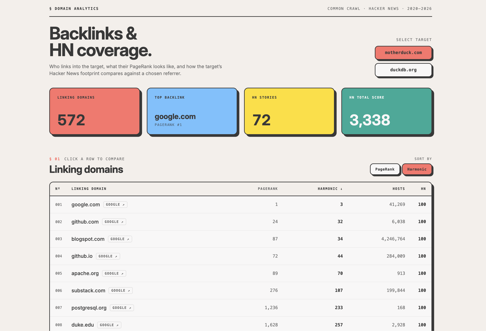

# Starter Data Warehouse on MotherDuck

Minimal `dbt-duckdb` starter project for building a MotherDuck warehouse. The example uses the Common Crawl hyperlink graph, a useful dataset to understand which websites link to your website(s). It defaults to `motherduck.com` and `duckdb.org`, with domains configured in `dbt_project.yml`. It combines this data with HackerNews data allowing you to both see how large joins across different datasets work, as well as actually see interesting stories from the domains linking into your target domain.

With this setup you'll learn how to:

- Turn large CSV source data into performant MotherDuck tables
- Combine data from different sources with dbt
- Use validated and tested marts to deploy a MotherDuck Dive and visualize your data



## Setup

Install dependencies with `uv`:

```sh
uv sync
```

Create a MotherDuck token. Domains are configured in `dbt_project.yml` under `commoncrawl_domains`; add more domains to that list as needed.

```sh
export MOTHERDUCK_TOKEN="..."
```

Validate the project:

```sh
uv run dbt debug --profiles-dir .
uv run dbt parse --profiles-dir .
```

Build the warehouse:

```sh
uv run dbt build --profiles-dir .
```

## Deploy the Dive

The example Dive lives in `dives/backlinks-hn/dive.tsx` and queries the dbt mart
tables in MotherDuck. Build the dbt project first, then deploy the Dive manually
with the DuckDB CLI:

```sh
export MOTHERDUCK_TOKEN="..."
export DBT_DUCKDB_PATH="md:my_db"
export DBT_SCHEMA="dbt_dev"
uv run dbt build --profiles-dir .
./scripts/deploy-dive.sh backlinks-hn
```

For production, use the same database and schema values for the dbt build and
the Dive deploy:

```sh
export MOTHERDUCK_TOKEN="..."
export DBT_DUCKDB_PATH="md:dbt_prod"
export DBT_SCHEMA="dbt_main"
uv run dbt build --target prod --profiles-dir .
./scripts/deploy-dive.sh backlinks-hn
```

The deploy script replaces the Dive database and schema placeholders with
`${DBT_DUCKDB_PATH#md:}` and `${DBT_SCHEMA}_mart`, so `DBT_DUCKDB_PATH` and
`DBT_SCHEMA` must match the values used for the dbt build.

For a preview deploy, set `PREVIEW_BRANCH`; the script appends the branch name
to the Dive title so it does not overwrite the production Dive:

```sh
PREVIEW_BRANCH="$(git branch --show-current)" ./scripts/deploy-dive.sh backlinks-hn
```

The deploy script reads `dives/<name>/dive-manifest.json`, loads the local
`dive.tsx` source with DuckDB `read_text()`, and creates or updates the Dive in
MotherDuck with the `MD_CREATE_DIVE` and `MD_UPDATE_DIVE_CONTENT` functions.

The Hacker News staging model reads from the full MotherDuck
[Hacker News example dataset](https://motherduck.com/docs/getting-started/sample-data-queries/hacker-news/)
and attaches the share before reading the source:

```sql
ATTACH IF NOT EXISTS 'md:_share/hacker_news/de11a0e3-9d68-48d2-ac44-40e07a1d496b' AS hacker_news;
```

## Project shape

- `models/staging/commoncrawl`: source-backed tables over the Common Crawl remote gzip files. Note that the Common Crawl edges file is ~14GB.
The model has been set to incremental so it is not accidentally redownloaded on every dbt run.
- `models/staging/hackernews`: Hacker News stories from `hacker_news.main.hacker_news`.
- `models/intermediate`: target-domain joins and edge expansion.
- `models/marts`: tested tables that are ready to query.

The default dataset is the Common Crawl `cc-main-2026-jan-feb-mar` domain
hyperlink graph:

- `domain-ranks`: domain PageRank and harmonic centrality.
- `domain-vertices`: domain ids and reversed host names.
- `domain-edges`: domain-to-domain links, filtered to the configured domains.

## Resources:
- [Common Crawl Web Graph Index](https://data.commoncrawl.org/projects/hyperlinkgraph/cc-main-2026-jan-feb-mar/index.html)
- [HackerNews dataset](https://motherduck.com/docs/getting-started/sample-data-queries/hacker-news/)
- [dbt-duckdb documentation](https://github.com/duckdb/dbt-duckdb)
