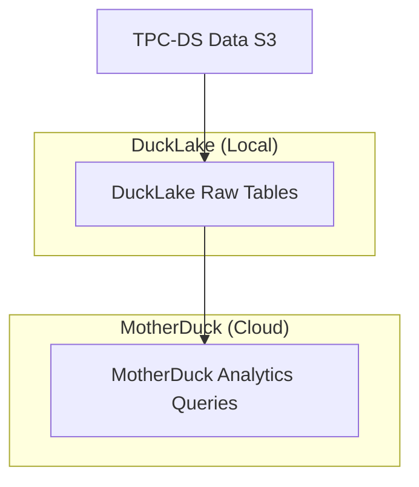

# MotherDuck DuckLake Integration with dbt and TPC-DS

This project demonstrates how to load TPC-DS data into DuckLake using dbt and create analytical queries in a MotherDuck database. The example uses the industry-standard TPC-DS benchmark dataset and shows a modern data architecture pattern with DuckLake for storage and MotherDuck for analytics.

## Architecture

The project is structured in two main layers:

1. **Raw Data Layer**: TPC-DS tables stored in DuckLake (local tables)
2. **Analytics Layer**: Query models stored in MotherDuck database (`my_db`)

## Data Sources

The project uses TPC-DS Scale Factor 100 data from S3:
- **Location**: `s3://devrel-test-data/tpcds/sf100/`
- **Format**: Parquet files
- **Tables**: 25 TPC-DS tables including `customer`, `store_sales`, `catalog_sales`, `web_sales`, etc.

## Project Structure

```
models/
├── tpcds/
│   ├── raw/          # TPC-DS base tables (materialized as tables in DuckLake)
│   │   ├── _sources.yml
│   │   ├── call_center.sql
│   │   ├── customer.sql
│   │   └── ... (25 tables total)
│   └── queries/      # TPC-DS analytical queries (materialized in MotherDuck)
│       ├── query_1.sql
│       ├── query_2.sql
│       └── ... (99 queries total)
```

## Configuration

### Profiles.yml
```yaml
dbt_ducklake:
  outputs:
    motherduck:
      type: duckdb
      path: 'md:dbt_ducklake'
      is_ducklake: true
      schema: test
      threads: 4
  target: motherduck
```

### Model Configuration
- **Raw tables**: Stored locally in DuckLake with `raw` schema
- **Query models**: Stored in MotherDuck database `my_db`

## Data Flow



## Running the Project

1. Install dependencies:
   ```bash
   uv sync
   ```

2. Build the project:
   ```bash
   uv run dbt build
   ```

This will:
- Create 25 TPC-DS tables in DuckLake from S3 parquet files
- Execute 99 TPC-DS analytical queries and store results in MotherDuck

Your browser will prompt for MotherDuck authentication unless you have token authentication configured.

## TPC-DS Queries

The project includes all 99 standard TPC-DS queries, providing a comprehensive benchmark suite for testing analytical performance across the DuckLake-MotherDuck architecture.
