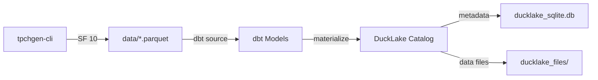

# Local DuckLake Integration with dbt and TPC-H

This project demonstrates how to use DuckLake locally with dbt to manage TPC-H benchmark data. DuckLake is DuckDB's extension that provides a lakehouse-style catalog on top of local storage, giving you Iceberg-like table management without the cloud overhead. Perfect for local development and testing!

## What is DuckLake?

DuckLake is a DuckDB extension that adds catalog management capabilities to your local DuckDB database. It uses either SQLite or PostgreSQL as a metadata store while keeping your actual data in parquet files. Think of it as a lightweight lakehouse right on your laptop.

## Architecture

This project uses a simple, local-first architecture:

1. **Data Generation**: TPC-H data generated locally using `tpchgen-cli` at scale factor 10
2. **Storage Layer**: Parquet files stored in the `data/` directory
3. **Catalog Layer**: DuckLake manages metadata using SQLite (stored in `ducklake_sqlite.db`)
4. **Transform Layer**: dbt models that read from local parquet and materialize tables in the DuckLake catalog

## Data Sources

The project uses TPC-H benchmark data:
- **Generated with**: `tpchgen-cli` at Scale Factor 10
- **Location**: `data/` directory (local parquet files)
- **Format**: Parquet
- **Tables**: 8 TPC-H tables (`customer`, `lineitem`, `nation`, `orders`, `part`, `partsupp`, `region`, `supplier`)

## Project Structure

```
dbt-local-ducklake/
├── data/                    # TPC-H parquet files (generated via tpchgen-cli)
│   ├── customer.parquet
│   ├── lineitem.parquet
│   ├── nation.parquet
│   ├── orders.parquet
│   ├── part.parquet
│   ├── partsupp.parquet
│   ├── region.parquet
│   └── supplier.parquet
├── models/
│   └── tpch/
│       ├── raw/             # TPC-H base tables (materialized in DuckLake)
│       │   ├── _sources.yml
│       │   ├── customer.sql
│       │   └── ... (8 tables total)
│       └── queries/         # Analytical queries
│           └── test.sql
├── ducklake_sqlite.db       # SQLite metadata catalog
├── ducklake_files/          # DuckLake managed parquet files
└── profiles.yml
```

## Configuration

### Profiles.yml

The project supports two DuckLake backends:

**Option 1: SQLite Backend (default)**
```yaml
dbt_local_ducklake:
  outputs:
    local_sqlite:
      type: duckdb
      threads: 4
      extensions:
        - ducklake
        - sqlite
      attach:
        - path: "ducklake:sqlite:ducklake_sqlite.db"
          alias: catalog
          options:
            data_path: ducklake_files
  target: local_sqlite
```

**Option 2: PostgreSQL Backend**
```yaml
local:
  type: duckdb
  threads: 4
  extensions:
    - ducklake
    - postgres
  secrets:
    - name: ducklake_secret
      type: postgres
      host: localhost
      port: 5432
      database: ducklake_catalog
  attach:
    - path: "ducklake:postgres:"
      alias: catalog
      options:
        data_path: data_files
        meta_secret: ducklake_secret
```

### Model Configuration
- **Raw tables**: Materialized as tables in the DuckLake catalog with `raw` schema
- **Source data**: Read from local parquet files in `data/` directory
- **Catalog**: Attached as `catalog` database in DuckDB

## Data Flow



## Running the Project

### Prerequisites
- Python environment with `uv` installed
- dbt-duckdb

### Setup

1. **Generate TPC-H data** (if not already present):
   ```bash
   # Install tpchgen-cli if needed
   pip install tpchgen-cli
   
   # Generate TPC-H data at scale factor 10
   tpchgen-cli --scale-factor 10 --output-dir data
   ```

2. **Install dbt dependencies**:
   ```bash
   uv sync
   ```

3. **Build the project**:
   ```bash
   uv run dbt build
   ```

This will:
- Read TPC-H parquet files from the `data/` directory
- Create 8 TPC-H tables in the DuckLake catalog
- Store metadata in SQLite and data files in `ducklake_files/`

### Running Queries

Once built, you can query your data using dbt or directly with DuckDB:

```bash
# Run dbt models
uv run dbt run

# Run specific models
uv run dbt run --select customer

# Open DuckDB REPL with catalog attached
duckdb -c "INSTALL ducklake; LOAD ducklake; ATTACH 'ducklake:sqlite:ducklake_sqlite.db' AS catalog; USE catalog; SELECT * FROM raw.customer LIMIT 10;"
```

## Why DuckLake Locally?

You might wonder: why use DuckLake for local development? Here are a few good reasons:

1. **Catalog Management**: Get table versioning and metadata management without setting up a full lakehouse
2. **Development Parity**: Match your production lakehouse patterns in local development
3. **Flexible Backends**: Choose SQLite for simplicity or PostgreSQL for multi-user scenarios
4. **Data Isolation**: Keep metadata separate from data files for easier management
5. **Portable**: Your entire analytical database fits in a few files you can commit or share

## TPC-H Benchmark

The TPC-H benchmark is an industry-standard decision support benchmark consisting of 8 tables and 22 analytical queries. At scale factor 10, this generates approximately 10GB of data across all tables, providing a realistic dataset for testing and development.
