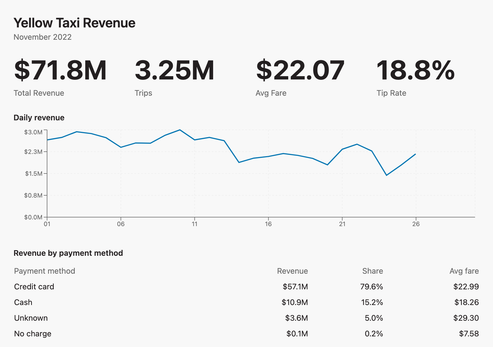
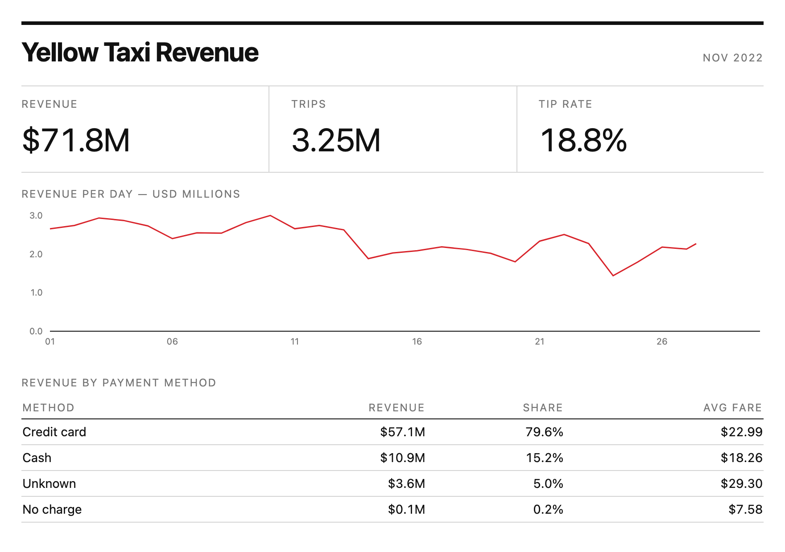
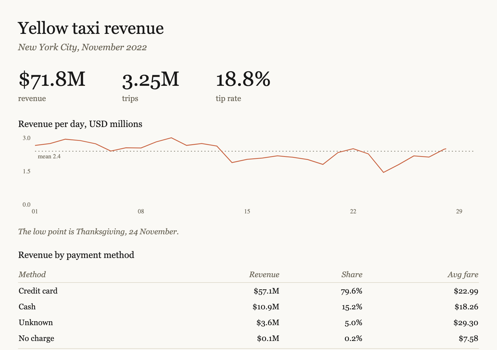
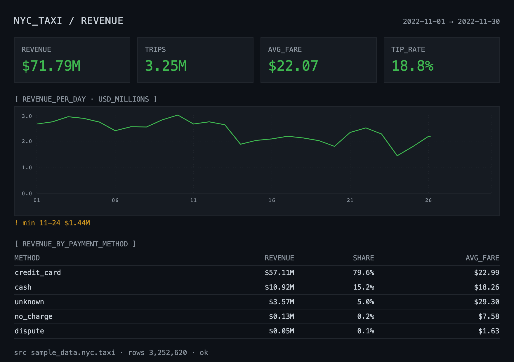

# Give Every Dive Your Brand Style With a Guide

An agent building a Dive reads MotherDuck's built-in design conventions first: a default palette, KPI and chart layout rules, and a visual checklist. Those defaults are good, and they are not yours. Define your brand rules once as a Guide, publish it to your organization, and every Dive anyone builds carries them — nobody has to remember to ask.

`dive-style-guide.sql` is the annotated blank to copy for your own brand. `styles/` holds four finished looks you can run as they are, screenshots included, so you can see how far a Guide moves the output before writing one.

## How it works

`dives` is a reserved topic name. A Guide filed there is appended to the Dive instructions an agent receives before it starts building, listed by title and description alongside its ID. The agent reads the ones that look relevant in full.

Two things follow from that mechanism, and they shape how the example Guides are written:

- **The description is the hook.** It's the only text an agent sees before deciding whether to open the Guide, so it states what the Guide governs rather than what it is.
- **Write only the differences.** The MotherDuck defaults are already in the agent's context. A Guide that restates them costs tokens and changes nothing. Each example covers color, typography, number and date formatting, layout, charts, tables, and copy — and stays quiet everywhere else.

The same mechanism works for Flights under the reserved `flights` topic, where the content is scheduling standards, naming rules, and reusable ingest patterns rather than visual conventions.

## Pick a starting point

Same three queries against `sample_data.nyc.taxi`, same Dive viewport, one Guide swapped:

| No Guide — the MotherDuck defaults | [Swiss minimal](styles/swiss-minimal.sql) |
|---|---|
|  |  |
| [Paper](styles/paper.sql) | [Editorial](styles/editorial.sql) |
|  |  |
| [Terminal](styles/terminal.sql) | |
|  | |

What each one changes, beyond the palette:

- **Swiss minimal.** Hairline rules instead of cards, uppercase micro-labels, three KPIs at normal weight, no gridlines, one red accent for every series. Reads as a printed report.
- **Paper.** Serif throughout including axis ticks, cream stock, clay line, a dashed mean line, and the observation in an italic note under the chart rather than in the title.
- **Editorial.** Newsroom conventions: a red marker block, a serif headline that states the finding with the comparison behind it, a sans dek carrying place, period and unit, bars with the scale on the right, and a source line on every page.
- **Terminal.** The one style where panel chrome is correct. Monospace everywhere, bracketed `snake_case` section headers, green values with amber anomaly callouts, a status line closing the page. For dashboards people watch during an incident, not for anything a customer reads.

Run one as-is to see the shape of a working Guide, then edit the palette and copy rules. Only one `dives` Guide should govern a given look — installing several leaves the agent to choose.

## What you'll adjust

Everything inside the `content` string, whether you start from `dive-style-guide.sql` or one of the four styles:

- **Palette.** Replace the hex values with your brand colors. Keep the distinction between a primary series color and directional positive/negative colors — an agent that treats every downward line as negative produces misleading charts.
- **Typography.** Which of `font-sans`, `font-serif`, and `font-mono` the page uses, plus weight, size, tracking, and case for titles, labels, and KPI values. Restate the family in the Recharts tick props; SVG text does not inherit Tailwind font classes.
- **Formatting.** Currency scale and precision, percentage precision, whether units live on the axis or in the title, date formats for axis ticks against table cells.
- **Layout.** KPI count, whether sections carry borders or only whitespace, how many charts belong on a page, table row caps.
- **Copy.** Whether chart titles state the measure or the finding. This one rule prevents a lot of unwanted editorializing — and Editorial shows the deliberate exception, where the headline carries the finding and names the comparison it rests on.

Also change `title` and `description` to name your organization, and decide on `access`. Every file creates a private Guide (`access = 'user'`) so you can try it before it affects anyone else.

## Questions to answer

- Do you have a documented brand palette, or are you standardizing one here for the first time? If the latter, pick five or six categorical colors that stay distinguishable next to each other.
- Should this be personal or org-wide? Start personal, confirm the output looks right, then promote it.
- Does your team already have styling rules living somewhere else — a design system doc, a BI tool theme? Copy from there rather than inventing a second source of truth.
- Do dark and light dashboards serve different audiences? Then they are two Guides with two clear descriptions, not one Guide with a mode switch the agent has to guess.

## Run it

1. Open `dive-style-guide.sql`, or one of `styles/*.sql`, and edit the `content` block to match your conventions.
2. Run it in the MotherDuck UI, or through any DuckDB client attached to MotherDuck. It returns the new Guide's `id`.
3. Ask an agent to build a Dive and check that it picks up your rules.
4. When the output looks right, uncomment the `MD_SET_GUIDE_ACCESS` call at the bottom of the file, fill in the ID, and run it to publish the Guide org-wide. That step needs admin permission.

To verify the Guide is filed correctly at any point:

```sql
SELECT id, title, description, access
FROM MD_LIST_GUIDES(topic = 'dives');
```

## Caveats

- The topic must read exactly `dives`. A nested topic like `dives/style` is not the reserved topic and won't reach the Dive instructions.
- Style Guides are deliberately absent from the query-side Guide overview, so an agent preparing to write SQL never loads them. They surface through `get_dive_guide` and `list_guides` instead. If you're checking whether the Guide exists and looking at `get_query_guide`, you won't find it.
- Promoting a Guide with `MD_SET_GUIDE_ACCESS` does not transfer ownership. The creator remains the owner and the only account that can delete it. For a Guide the whole team should maintain, create it from a shared service account.
- Rules an agent can't act on get ignored. "Make it feel premium" does nothing; a hex value and a KPI count do.
- The Dive runtime loads no external fonts, so typography rules only have three families to work with: `font-sans`, `font-serif`, and `font-mono`. Naming your licensed brand typeface in a Guide gets you the default sans.
- Recharts renders axis labels as SVG text that ignores Tailwind font classes. A Guide asking for serif or monospace has to say so in the tick props — `tick={{ fontFamily: "serif" }}` — or the charts will silently stay sans while everything around them changes.
- Arbitrary-value Tailwind classes such as `bg-[#fff1e5]` do not resolve in the Dive runtime. Write brand colors as hex values in the Guide and let the agent apply them through inline `style`.
- On a dark palette, state the dimmest text color you will accept. Left to itself an agent will reach for grays that fail contrast at label sizes.
- The screenshots come from the components in `preview/`, written from each Guide and rendered against real rows from `sample_data.nyc.taxi`. An agent building from the same Guide will land on the same palette, formatting, and chrome, and will not reproduce the layout pixel for pixel.

## Files

| File | What it does |
|------|--------------|
| `dive-style-guide.sql` | The annotated blank: creates a Guide under the reserved `dives` topic with a worked style guide to edit, and commented follow-ups for publishing and verifying |
| `styles/swiss-minimal.sql` | White field, black ink, one red accent, rules instead of cards |
| `styles/paper.sql` | Cream stock, serif throughout, clay accent, minimum ink |
| `styles/editorial.sql` | Newsroom graphic: tinted paper, red marker, finding in the headline, source line |
| `styles/terminal.sql` | Dark operational console, monospace, green values and amber warnings |
| `preview/` | Vite harness that renders each style at the Dive viewport and writes `assets/*.png`. `npm install && npm run shoot` |
| `assets/*.png` | The rendered screenshots used above |

## Learn more

- [Style Dives and Flights with Guides](https://motherduck.com/docs/key-tasks/guides/style-your-dives-with-guides) — the full how-to, including the Flight equivalent
- [Using Guides to improve AI query accuracy](https://motherduck.com/docs/key-tasks/guides/) — topics, governance, references, and Guide chaining
- [Dives](https://motherduck.com/docs/key-tasks/dives/) — what Dives are and how agents build them
- [`preview/README.md`](preview/README.md) — how the screenshots are produced, and how to point the harness at live data
- MCP tools involved: `get_dive_guide` returns the Dive instructions with your `dives` Guides appended, `create_guide` and `set_guide_access` are what an agent calls when you ask it to do this conversationally instead of running the SQL
