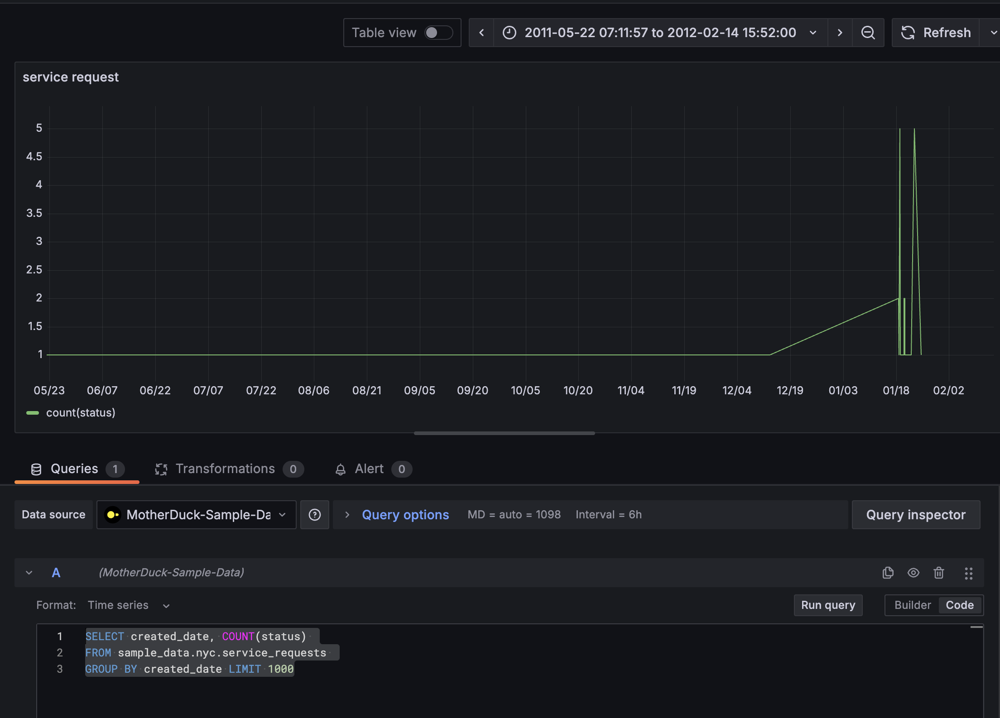

# grafana-devops-provisioning

# Local Grafana Setup Guide

This repository contains scripts and instructions for setting up a local Grafana instance with MotherDuck-DuckDB integration.

## Prerequisites
- Clone this repo
- Docker ([Installation guide](https://docs.docker.com/engine/install/))

## Quick Start

```bash
./setup.sh

```

Once the script completes, access Grafana at `localhost:3000` (the default credentials are admin/admin)

## Dashboard Setup

1. Navigate to the dashboard section
2. Create a new dashboard
3. Select MotherDuck-DuckDB as your data source
4. Important: Set the format to time series at the top of the query
5. Switch from builder to code in the query section if you'd like to enter SQL manually



## Example Query
```sql
SELECT created_date, COUNT(status)
FROM sample_data.nyc.service_requests
GROUP BY created_date LIMIT 1000
```

## Adding dashboards
If you have created a dashboard you want others to use it here is guide on how

1. There is an `export` button on the dashboard. Press it. If not you can go to the dashboard settings and under `JSON model` you can copy the json
2. copy the json and create a json file under the privisioning/dashboards/json
    - Example
        - provisioning/dashboards/json/mdw.json
3. save, commit, push
4. create a Pull Request
