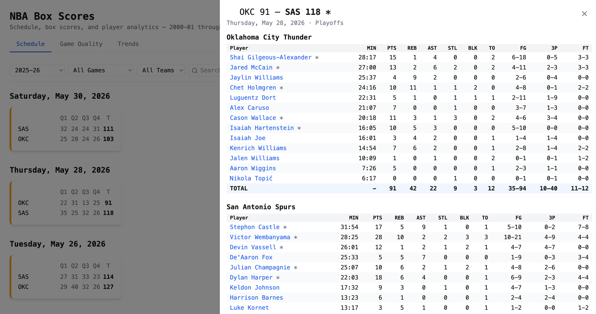

# NBA Box Scores on MotherDuck Flights and a Dive

NBA box scores on a MotherDuck-native stack — a migration of the legacy
TypeScript/GitHub-Actions ingest + Next.js/Vercel frontend at
[`matsonj/nba-box-scores`](https://github.com/matsonj/nba-box-scores) onto
MotherDuck **Flights** + a **Dive**. It shows the pattern of keeping a database
current with a scheduled Flight and shipping a Dive on top that queries it live.
Everything reads/writes the `nba_box_scores_v3` database.



Two decoupled slices:

| Slice | What it is |
|---|---|
| [`flight/`](./flight/) | Python ingest pipeline, run as scheduled MotherDuck **Flights**. `nba_nightly` ingests the current season into the production tables; `nba_backfill` is on-demand for historical season ranges. |
| [`dive/`](./dive/) | The consolidated frontend, built as a MotherDuck **Dive** — schedule + box scores, a Game Quality leaderboard, and trends. Reads what `flight/` writes. |

The Flight keeps `nba_box_scores_v3` current; the Dive queries it live. Each
slice's README covers its own deeper development and deploy details.

## What you'll adjust

| Knob | Where | Purpose |
|---|---|---|
| `database` | `flight/src/nba_box_scores_pipeline/config.py` | Target MotherDuck database. Default `nba_box_scores_v3`. |
| `NBA_INGEST_SEASON` | env (nightly) | Season-start year to ingest (e.g. `2025` for 2025-26). Defaults to the current season. |
| `NBA_INGEST_TABLE_SUFFIX` | env | Write an isolated sandbox table set (e.g. `_new`) for validation. Default `""` = production tables. |
| `NBA_BACKFILL_START_SEASON` / `NBA_BACKFILL_END_SEASON` | env (backfill) | Inclusive historical season range for `nba_backfill`. |
| `NBA_INGEST_DELAY_MS` / `NBA_INGEST_MIN_DELAY_MS` / `NBA_INGEST_MAX_DELAY_MS` | env | Adaptive API request pacing. Defaults `500` / `200` / `10000`. |
| `NBA_INGEST_FORCE` / `NBA_INGEST_FILL_RAW` / `NBA_INGEST_DRY_RUN` | env | Re-ingest logged games / fetch only missing raw JSON / log without writing. Set `1` to enable. |
| `NBA_FLIGHT_REPO_BRANCH` | env | Branch the Flight bootstrapper clones at run time. Default `main`. |
| `md_token_name` | `flight/flights/*/flight.toml` | MotherDuck token the Flight runtime injects as `MOTHERDUCK_TOKEN`. Default `dives-loader-nba`. |
| `schedule_cron` | `flight/flights/nba_nightly/flight.toml` | Nightly schedule. Default `0 16 * * *` (16:00 UTC). |
| `DIVE_TITLE` / `NBA_DIVE_DATABASE` | env (`dive/scripts/deploy-dive.sh`) | Dive title to create/update (default `NBA Box Scores`) and the source database bound to its `nba_box_scores_v3` alias. |

## Questions to answer

- Which MotherDuck database holds the box-score tables? (Default `nba_box_scores_v3`.)
- Which seasons do you need — the current season on a nightly schedule, a historical range to backfill, or both?
- Which MotherDuck token name does the Flight inject, and does it have read+write on that database? (Default `dives-loader-nba`.)
- Production tables, or an isolated `_new` suffix to validate a run before promoting?
- What Dive title do you deploy under (the script resolves it by title), and are you deploying with a DuckDB **1.5.2** client (MotherDuck rejects 1.5.3)?

## Run it

The two slices are independent. Develop the ingest pipeline and the Dive
separately; see [`flight/README.md`](./flight/README.md) and
[`dive/README.md`](./dive/README.md) for the full walkthroughs.

Ingest pipeline (local):

```bash
cd nba-box-scores/flight
uv venv
uv pip install -e ".[dev]"

export MOTHERDUCK_TOKEN=<token with nba_box_scores_v3 read+write>
python flights/nba_nightly/main.py
```

Dive (build the deployable bundle):

```bash
cd nba-box-scores/dive
npm install      # esbuild
npm run build    # → dist/dive.jsx
```

### Deploy as a Flight

One command registers (or updates) both Flights from their `flight.toml` +
`main.py`:

```bash
export MOTHERDUCK_TOKEN=<token that can manage flights>
cd nba-box-scores/flight
uv run scripts/deploy_flights.py
```

[`flight/scripts/deploy_flights.py`](./flight/scripts/deploy_flights.py) calls
`MD_CREATE_FLIGHT` / `MD_UPDATE_FLIGHT`, resolving each flight by name via
`MD_FLIGHTS()`. The registered `source_code` is a thin bootstrapper that clones
this repo at `NBA_FLIGHT_REPO_BRANCH` (default `main`) and runs the entrypoint —
so you only deploy for the **first** registration (or when the bootstrapper,
token, schedule, config, or requirements change); **shipping new pipeline code
afterwards is just a `git push`**. `nba_nightly` carries
`schedule_cron = "0 16 * * *"`; `nba_backfill` is on-demand (trigger it with
`MD_RUN_FLIGHT`). See [`flight/README.md`](./flight/README.md) for details.

To deploy the Dive, run [`dive/scripts/deploy-dive.sh`](./dive/scripts/deploy-dive.sh):
it builds the bundle and resolves the Dive by title via `MD_LIST_DIVES()`,
creating it the first time and updating its content after — no Dive id is pinned
in the repo. See [`dive/README.md`](./dive/README.md) for the title/database
overrides and the underlying SQL.

## How it works / Learn more

- [`flight/README.md`](./flight/README.md) — pipeline layout, local development, and Flight registration.
- [`dive/README.md`](./dive/README.md) — the three-tab Dive, the esbuild bundle, deploy SQL, and data-modeling notes (stable `entity_id` aggregation, the `game_quality = -1` sub-15-minute sentinel, and Dive-renderer styling caveats).
- For Flight and Dive deployment mechanics, see the MotherDuck MCP guides (`get_flight_guide`, `get_dive_guide`) and `ask_docs_question`.
